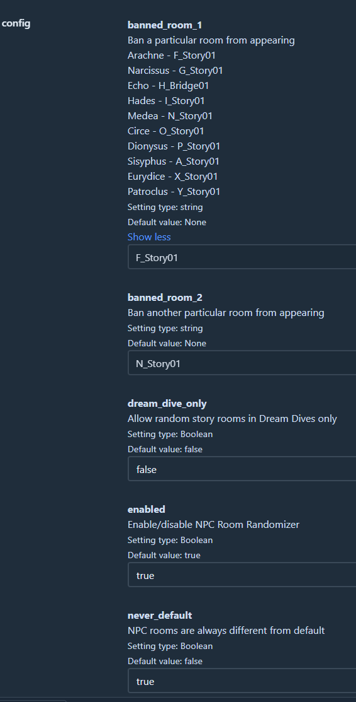

## NPC Room Randomizer

Randomizes NPC story rooms between each other. Configurable to never have the default story room. Also supports NPC story rooms from Zagreus' Journey.

## Installation

Use r2modman by ebkr from [Thunderstore](https://thunderstore.io/package/ebkr/r2modman/) or [GitHub](https://github.com/ebkr/r2modmanPlus/releases/latest).

While the mod has been tested decently well, there can still be some scenarios which didn't show up in testing that break the game. It is recommended to backup your save from `%USERPROFILE%\Saved Games\Hades II\Profile*.sav` in case there are issues.

It is recommended to not uninstall or load the game un-modded while in the middle of a modded run.

## Configuration

Mod can be configured through the r2modman config editor. Requires the game to be run atleast once with the mod installed.

## Issues and feedback

Report any issues or feedback [here](https://github.com/adi1998/NPCRando/issues) or on the [Hades Modding Discord](https://discord.gg/bKvJTAJj)